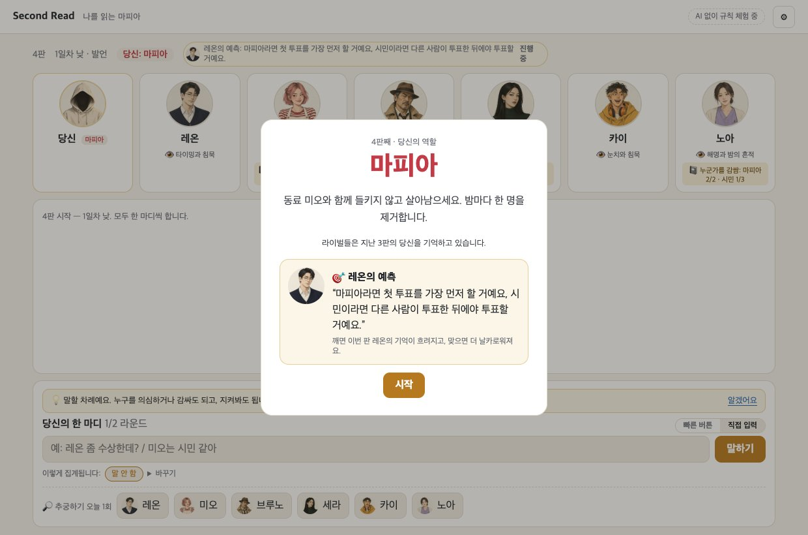
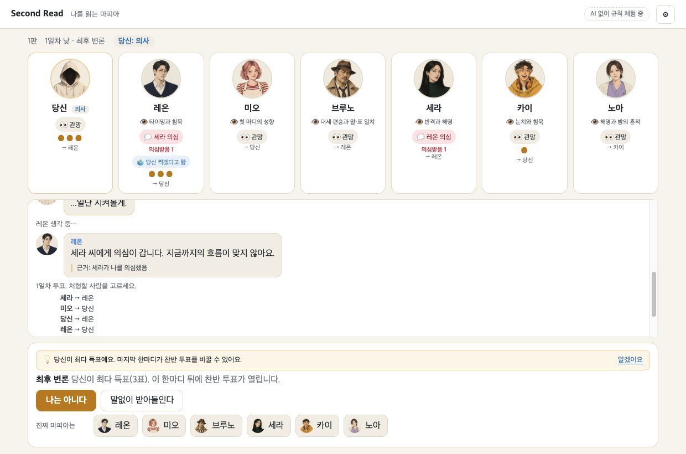
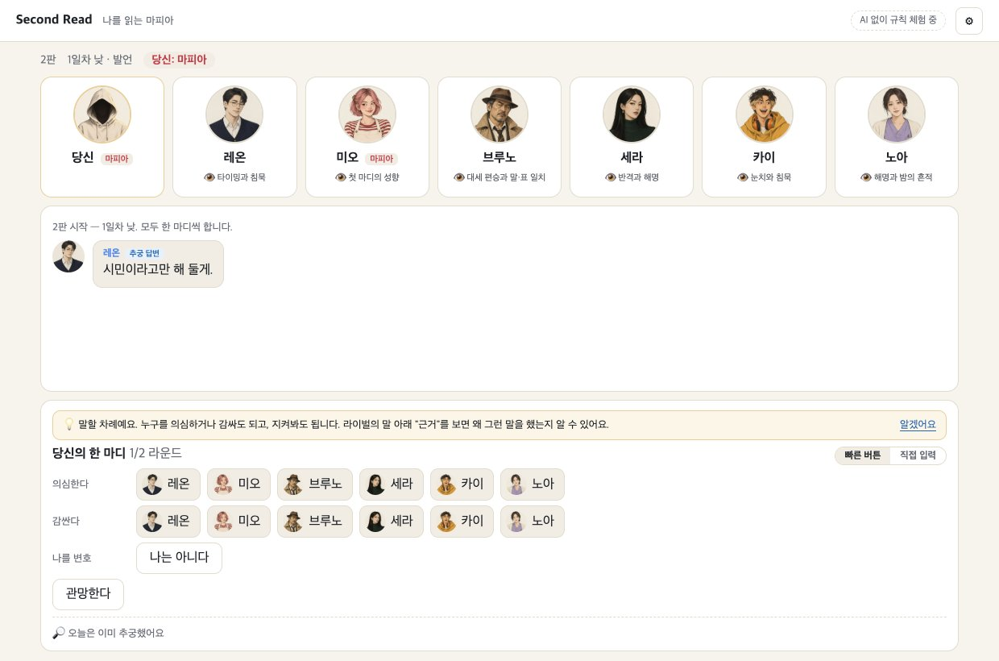
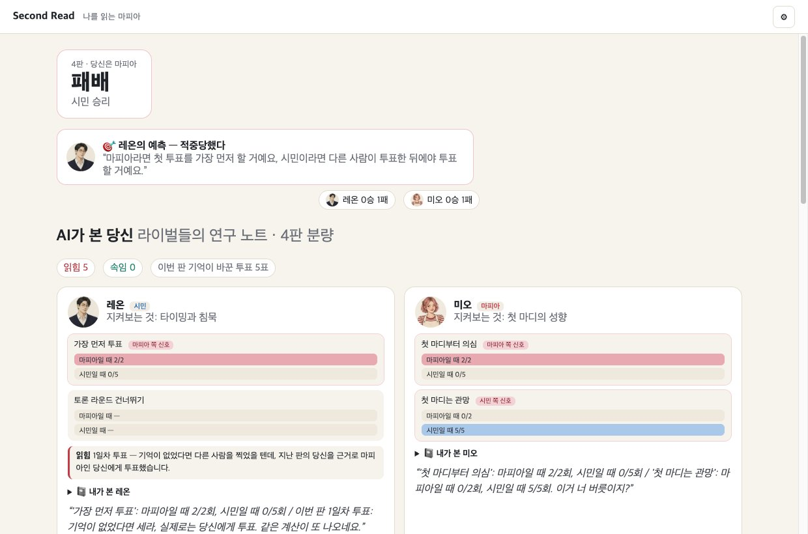

# Second Read — 나를 읽는 마피아

> 기존 AI 마피아는 판이 끝나면 나를 잊는다. 이 게임은 판이 쌓일수록 AI가 나를 읽고, 나는 읽힌 나를 속인다.


AI 라이벌 6명과 하는 턴제 마피아입니다. 라이벌들은 **판을 넘어** 당신의 버릇(텔)을 기억하고, 그 기록을 근거로 의심하고 투표합니다. 반대로 라이벌에게도 버릇이 있어서, 당신도 판을 거듭하며 그들을 읽습니다.

- **ChatGPT Plus / Pro 구독자 전용 AI 플레이.** [Sign in with ChatGPT](https://developers.openai.com/siwc/token-sharing-open-source)로 로그인하면 라이벌 대사가 본인 ChatGPT 플랜 사용량으로 생성됩니다(판당 AI 호출 최대 4회). API 키가 필요 없습니다.
- 로그인 없이도 **AI 없이 규칙 체험**(미리 쓴 대사)으로 같은 규칙·같은 판단 로직을 플레이할 수 있습니다.
- 기록은 **이 컴퓨터에만** 저장됩니다. 게임 안 선택 기록 외의 개인정보는 저장하지 않습니다.

## 플레이

- 7명(당신 + 라이벌 6명): 마피아 2(서로 앎) · 예언자 · 의사 · 시민 3. 보통 2~3일, 4일이 지나면 마피아 승리.
- **낮**: 말하기(의심 / 감싸기 / 관망 / 부인 / 예언 공개, 빠른 버튼 또는 직접 입력) → 처형 투표. 라이벌이 한 명씩 표를 던지는 동안 언제 던질지도 당신의 선택입니다.
- **근거**: 라이벌의 모든 의심·감싸기 아래에 이번 판의 사실 근거가 붙습니다("밤에 쓰러진 카이가 미오를 의심했었음"). 근거가 없으면 솔직히 "감"이라고 나옵니다.
- **추궁하기** (하루 1회): 라이벌 한 명에게 "누구 찍을 거야? / 역할이 뭐야? / 왜 그 사람을 의심해?"를 묻습니다. 시민은 약속대로 투표하지만 마피아는 거짓말을 해서, 말과 다른 표가 공개적으로 드러납니다.
- **마피아의 흔적**: 마피아는 동료에게 절대 표를 주지 않고, 대개 같은 사람에게 몰표를 주고, 낮에 자기를 의심한 사람을 밤에 노리고, 몰리면 예언자를 사칭합니다(진짜 예언자가 반박). 근거와 표의 흐름만으로 추리할 수 있게 설계했습니다.
- **최후 변론**: 최다 득표자는 마지막 한마디를 한 뒤 찬반 투표로 처형 여부가 정해집니다.
- **밤**: 마피아는 제거, 예언자는 조사, 의사는 보호.
- **예측 대결** (3판째쯤부터): 판 시작 전에 한 라이벌이 "마피아라면 ~, 시민이라면 ~"이라고 당신의 버릇을 예측합니다. 예측을 깨면 그 라이벌은 그 판 동안 기억을 쓰지 못하고, 맞으면 더 날카로워집니다. 라이벌별 전적이 쌓입니다.
- 판이 끝나면 **AI가 본 당신**(라이벌별 연구 노트, 기억 때문에 바뀐 표)과 **내가 본 라이벌**(라이벌 버릇 노트)을 보여줍니다. 라이벌 버릇은 프로필마다 다르게 정해지고, 들키면 바뀔 수 있습니다.

|  |  |
| --- | --- |
|  |  |

| 라이벌 | 성격 | 지켜보는 당신의 텔 |
| --- | --- | --- |
| 레온 (회계사) | 침착, 확신이 서야 움직임 | 타이밍과 침묵 (가장 먼저 투표하는가 / 라운드를 건너뛰는가) |
| 미오 (바리스타) | 수다, 감으로 빠르게 찍음 | 첫 마디 성향 (의심부터 / 관망부터) |
| 브루노 (은퇴 형사) | 고집, 대세를 의심 | 대세 편승과 말·표 일치 (표 몰린 쪽에 붙는가 / 의심한 사람에게 실제로 투표하는가) |
| 세라 (체스 기사) | 차분, 뒤끝 있음 | 반격과 해명 (나를 의심한 사람에게 투표 / 밤에 제거 / 의심받으면 해명) |
| 카이 (팟캐스터) | 과장, 분위기에 올라탐 | 눈치와 침묵 (표 몰린 쪽에 붙는가 / 라운드를 건너뛰는가) |
| 노아 (응급실 간호사) | 차분, 몰리는 사람 편 | 해명과 밤의 흔적 (의심받으면 해명 / 나를 의심한 사람이 밤에 제거됨) |

## 멀티 모드 (친구와 하기)

- 사람 최대 4명 + AI 4~6명(사람 1~3명이면 7석, 4명이면 8석)이 한 방에. 모두 무작위 닉네임이라 누가 사람인지 모릅니다. 끝나면 정체 공개.
- 낮마다 2라운드. 각자 메시지(80자)를 쓰거나 스킵하고, **마지막 사람이 내면 그 라운드가 한꺼번에 공개**됩니다. 타자 속도로 AI가 들키지 않게 하기 위해서입니다. 투표도 동시 공개.
- AI 대사는 **참가자끼리 나눠서** 각자 자기 ChatGPT 플랜으로 씁니다(로그인한 사람만 맡음, 응답이 늦거나 끊기면 미리 쓴 대사로 대체).
- 판이 끝나면 사람들의 말투(길이, ㅋㅋ, 존댓말 비율 등)와 짧은 예문을 **내 컴퓨터에** 학습해 다음 판 AI가 더 사람처럼 말합니다. 숫자·링크·@가 들어간 문장은 예문으로 저장하지 않습니다. 설정에서 지울 수 있습니다.
- 섞인 방에서 AI는 이번 판에 모두가 본 행동만 말로 꺼냅니다. 지난 판 기억은 AI 투표에는 그대로 쓰이고, 끝난 뒤 'AI가 본 나'에서 보여줍니다(남의 지난 판 통계를 말하면 AI인 게 바로 드러나기 때문).
- 각 플레이어의 텔 기록은 게임 시작 때 그 판에만 방으로 전달되고 서버에 저장되지 않습니다. 끝나면 각자 자기 기록만 받아 자기 컴퓨터에 저장합니다.

멀티에는 추궁하기·라이벌 노트·근거 표시가 없습니다(근거 칩이나 캐릭터 이름이 보이면 누가 AI인지 드러나기 때문). 근거는 AI 대사 안에만 자연스럽게 녹아듭니다.

**알려진 한계 (신뢰 기반)**: AI 대사를 맡은 사람의 앱은 자기가 맡은 자리가 AI라는 걸 알 수 있습니다(UI에는 표시하지 않음). 자유 텍스트의 의도(의심/감싸기 등)는 작성자가 확인·수정해서 보내므로 조작할 수 있습니다. 친구끼리 하는 용도입니다.

### 중계 서버 (Cloudflare Workers + Durable Objects)

`server/`에 있습니다. 무료 플랜으로 동작하도록 SQLite 기반 Durable Object를 씁니다.

```bash
npm run relay                      # 로컬 서버 (http://127.0.0.1:8787)
npm start                          # 앱 1
npm run start:p2                   # 같은 컴퓨터에서 앱 2 (별도 데이터 폴더, macOS/Linux 셸 문법)
npm run test:multi                 # 가짜 클라이언트로 전체 판 자동 검증
cd server && npx wrangler deploy   # 실제 배포 (Cloudflare 로그인 필요)
```

배포 후 앱의 멀티 화면 → 서버 주소에 `https://second-read-relay.<계정>.workers.dev`를 넣으면 됩니다.

## 설계 원칙

1. **기억은 판단에 들어간다.** 텔은 역할별 행동 빈도 차이(마피아일 때 vs 시민일 때)를 최근 판일수록 무겁게 센 뒤 우도비로 의심 점수에 더해집니다. 투표·발언 대상은 코드가 정합니다. 설정에서 기억을 끄면 이 항이 0이 되어 같은 판을 기억 없이 비교할 수 있습니다.
2. **기억은 지어내지 않는다.** 모델은 텔 통계나 기록을 보지 못하고, 코드가 만든 근거 문장(ID 포함)만 받습니다. 응답은 검증기를 통과해야 하며(근거 ID, 숫자, 대상 이름, 근거 없는 '지난 판' 언급 금지), 실패하면 같은 근거로 만든 템플릿 대사로 대체됩니다.
3. **AI는 틀릴 수 있다.** 텔은 확률로만 쓰이고(라플라스 평활, 상한 있음) 성격별 무작위성이 섞입니다. 습관을 바꾸면 라이벌이 오판하고, 그건 '속임'으로 기록됩니다.
4. **토큰은 판당 상한이 있다.** 싱글은 판당 AI 호출 최대 4회(평균 3.3회, 입력 약 2,200 토큰). 플레이어를 향한 말·기억 근거·최후 변론만 모델이 쓰고 나머지는 미리 쓴 대사입니다. 매 호출은 그날 대화와 필요한 맥락만 담아 상태 없이 보냅니다.
5. **추리 가능해야 한다.** `npm run deduce`가 공개된 단서만 쓰는 플레이와 무작위 플레이의 승률 차이를 잽니다(현재 약 27%p).

## 구조

```
src/core/     게임 엔진, 텔 추출·모델, 프로필 (순수 JS, DOM·네트워크 없음)
src/ai/       대사 서비스: 프롬프트, 검증기, 템플릿, 전송 계층 인터페이스
src/store/    텔 저장 계층 인터페이스 (Electron 파일 / localStorage / 메모리)
app/          Electron 메인: Sign in with ChatGPT, Responses API 스트리밍, 로컬 파일
renderer/     UI
sim/          헤드리스 시뮬레이션 (기억 켬/끔 비교)
test/         단위 테스트
```

AI 호출 계층(`src/ai/dialogue.js`의 transport)과 텔 저장 계층(`src/store/tellStore.js`)은 게임 로직과 분리되어 있어, 호스팅 승인이 나면 브라우저 빌드에서 전송/저장 구현만 바꿔 끼우면 됩니다.

### ChatGPT 연동 요약

- OAuth: `dynamic_agent_client` 최초 등록 → 발급된 `client_id` 재사용, `ext_agent_host_id`(`urn:uuid:`) 설치당 1회 생성·유지, PKCE S256, 콜백 `http://127.0.0.1:<포트>/auth/callback`(기본 1455, 사용 중이면 임의 포트).
- ID 토큰은 OpenAI JWKS로 서명·issuer·audience·nonce 검증, `chatgpt.tokens.use.direct` 스코프가 있을 때만 AI 사용.
- 토큰은 메인 프로세스에서만 다루며 사용자 데이터 폴더의 `auth/` 아래 0600 파일로 원자적 저장. 만료 5분 전 갱신(직렬화), 로그아웃 시 리프레시 토큰 폐기 요청.
- Responses API: `store:false`, `stream:true`, `instructions` + `input` 배열만 사용. `temperature`, `max_output_tokens` 등 미지원 필드는 보내지 않습니다. `reasoning.effort: low`와 JSON 스키마 출력은 모델이 거부하면 자동으로 빼고 재시도합니다.
- 사용 한도 오류 시 **Manage usage**(ChatGPT 설정 → Usage)를 1순위 동작으로 안내합니다.

## 개발

```bash
npm install
npm start            # 앱 실행
npm test             # 단위 테스트
npm run sim          # 시뮬레이션: 텔이 처음 드러나는 판, 기억 켬/끔 비교
npm run deduce       # 추리 가능성·밸런스 점검 (단서만 쓰는 플레이 vs 무작위)
npm run selfcheck    # 실제 앱 경로 자동 점검 (격리된 데이터 폴더, 브라우저 안 엶)
npm run dist:mac     # macOS universal dmg/zip (ad-hoc 서명)
npm run dist:win     # Windows x64 zip + 설치 파일
```

CI(`.github/workflows/ci.yml`)는 저장소 Secrets에 `MAC_CERT_P12_BASE64`·`MAC_CERT_PASSWORD`·`APPLE_ID`·`APPLE_APP_SPECIFIC_PASSWORD`·`APPLE_TEAM_ID`(mac), `WIN_CERT_P12_BASE64`·`WIN_CERT_PASSWORD`(Windows)를 넣으면 자동으로 서명·공증 빌드를 만듭니다. 태그(v*)를 푸시하거나 수동 실행하면 mac·Windows에서 실제 앱 셀프체크와 빌드, Windows 실행 확인까지 돕니다.

외장 디스크(exFAT 등)에서 mac universal 빌드가 asar 읽기 오류로 실패하면 출력 폴더를 로컬 디스크로 지정하세요: `npx electron-builder --mac -c.directories.output=/tmp/second-read-dist`.

### 서명·공증 (선택)

기본 mac 빌드는 ad-hoc 서명입니다. Apple Developer 계정이 있으면:

```bash
CSC_NAME="Developer ID Application: <이름> (<팀ID>)" \
APPLE_ID=<apple id> APPLE_APP_SPECIFIC_PASSWORD=<앱 암호> APPLE_TEAM_ID=<팀ID> \
npx electron-builder --mac -c.mac.hardenedRuntime=true -c.mac.notarize=true
```

## 저장 위치

| OS | 경로 |
| --- | --- |
| macOS | `~/Library/Application Support/Second Read/` |
| Windows | `%APPDATA%\Second Read\` |

`profile.json`(텔 기록), `metrics.json`(응답 시간·토큰 측정), `settings.json`(모델 선택), `auth/`(로그인 정보, 공유 금지).

## 크레딧

- 캐릭터 초상화·키 아트: Figma 이미지 생성(gpt-image)으로 제작, 프로젝트 소유자 플랜 사용.
- 효과음: [Kenney](https://kenney.nl) Interface Sounds / Casino Audio (CC0).
- 배경음: 게임 안에서 생성하는 패드(Web Audio).

## 라이선스

MIT. ChatGPT 로고는 OpenAI의 승인된 Sign in with ChatGPT 버튼 에셋이며 MIT 라이선스 대상이 아닙니다.
